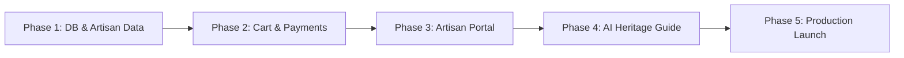

# 🏺 Parampara — Next Projected Roadmap & Milestone Plan

A phased development plan to transition **Parampara** from a functional prototype into a production-grade, full-fledged heritage luxury e-commerce platform.

---

## 📍 Current Project Status (Where We Are)

- [x] **Front-End Design System**: Luxury editorial aesthetics, Cormorant Garamond / Inter typography, responsive layouts.
- [x] **Core Pages**: `index.html`, `search.html`, `masterpiece.html`, `artisans.html`, `states.html`, `state_categories.html`, `about.html`, `collection.html`.
- [x] **User Authentication**: JWT sign-in/registration, Google OAuth integration, persistent global navigation state (`js/auth.js`).
- [x] **Backend Foundation**: Node.js + Express 5 REST API, Mongoose schemas for User & Product, database fallback mechanism.

---

## 🗺️ Projected Development Phases

---

## 🚀 Phase 1: Database & Data Expansion (Immediate / Next Step)

**Goal**: Connect a persistent cloud database and populate authentic craft datasets across all regions of India.

- [ ] **MongoDB Atlas Configuration**:
  - Whitelist production & local development IPs in Atlas.
  - Finalize connection string in `backend/.env`.
- [ ] **Artisan Data Model & Route**:
  - Create `backend/models/Artisan.js` (Bio, craft lineage, awards, years active, workshop photos).
  - Add `backend/routes/artisans.js` with full CRUD and category filtering.
  - Link `Product` schema to `Artisan` references via Mongoose `populate()`.
- [ ] **Comprehensive Data Seeding (`backend/seed.js`)**:
  - Seed catalog across North, South, East, West, and Central India.
  - Tag authentic **GI (Geographical Indication)** certifications for eligible crafts.

---

## 🛒 Phase 2: Shopping Cart & Checkout Engine

**Goal**: Transform browsing into full e-commerce checkout with secure INR payments.

- [ ] **Interactive Cart / Bag Drawer (`js/cart.js`)**:
  - Slide-out cart panel accessible on every page.
  - Real-time quantity adjustment, subtotal calculation, and shipping estimations.
  - Sync cart across devices for logged-in users via `/api/cart`.
- [ ] **Checkout Flow (`checkout.html`)**:
  - Multi-step form: Shipping Address ➔ Artisan Delivery Note ➔ Payment.
  - Pincode serviceability check for rural artisan pickup hubs.
- [ ] **Payment Gateway Integration**:
  - Integrate **Razorpay** / **Stripe** (UPI, Netbanking, Cards, EMI for luxury crafts).
  - Secure webhook handler (`/api/payments/verify`) for signature validation.
- [ ] **Order Management System**:
  - Create `models/Order.js` (Status: *Crafting / Ready / Dispatched / Delivered*).
  - User order history view in `collection.html` / `orders.html`.

---

## 🧑‍🎨 Phase 3: Artisan Direct Portal & Media Cloud

**Goal**: Empower master craftspeople and SHGs (Self-Help Groups) to manage their listings.

- [ ] **Artisan Dashboard (`artisan-portal.html`)**:
  - Artisan login with role-based access control (`role: 'artisan' | 'customer'`).
  - Listing creation form: Craft story, materials used, pricing breakdown, dimensions.
- [ ] **Cloudinary Image & Video Pipeline**:
  - Direct media upload for craft process videos & high-res artifact photos.
  - Automatic thumbnail generation and webp optimization.
- [ ] **Authenticity & GI Certificate Generator**:
  - Auto-generate downloadable digital Certificate of Authenticity (PDF) with unique craft serial numbers.

---

## 🤖 Phase 4: Cultural Heritage AI Assistant

**Goal**: Bring heritage storytelling to life with AI-driven recommendations and provenance guides.

- [ ] **Gemini Heritage Concierge**:
  - Floating interactive AI assistant widget on `search.html` & `masterpiece.html`.
  - Can answer cultural questions (*"What is the significance of Pattachitra colors?"*, *"Suggest a heritage gift for a housewarming under ₹25,000"*).
- [ ] **Interactive State Craft Visualizer**:
  - Dynamic SVG map interaction displaying craft density per district when hovering over Indian states.

---

## 🌐 Phase 5: Production Deployment & Hardening

**Goal**: Deploy for public access with top-tier security, speed, and SEO.

- [ ] **API Backend Deployment**:
  - Deploy Express API on **Render.com** or **Railway**.
  - Configure CORS allowlist, rate limiting (`express-rate-limit`), and HTTP headers (`helmet`).
- [ ] **Frontend Hosting**:
  - Deploy frontend to **Vercel** / **Netlify** / **Cloudflare Pages**.
  - Connect custom domain (e.g. `parampara-heritage.in`).
- [ ] **Performance & SEO Audit**:
  - Structured Data (Schema.org `Product` and `Artisan` markup) for Google Rich Snippets.
  - Image CDN caching and lazy loading optimizations.

---

## 📋 Recommended Immediate Next Steps

| Task | Priority | Estimated Time |
|---|---|---|
| **1. Connect Live Atlas MongoDB** | High | 1-2 hours |
| **2. Build Artisan Model & API** | High | 2-3 hours |
| **3. Implement Global Slide-Out Cart UI** | High | 1 day |
| **4. Setup Razorpay Test Mode Checkout** | Medium | 1-2 days |
